# Guía de Implementación Técnica V2: Botón "Material Preparado" (TAB0423)

**Versión:** 1.0 (Detallada)
**Plataforma:** Acumatica ERP 2025 R2
**Autor:** Alberto Polanco
**Fecha:** 14/05/2026

Esta guía está diseñada para que cualquier administrador de Acumatica pueda replicar la funcionalidad sin conocimiento previo del desarrollo actual.

## Objetivo 
Implementar en Acumatica un nuevo campo, dentro de la ventana de embarques, que almacene la fecha y la hora de termino de preparación del material solicitado en un embarque, con la finalidad de tener los datos necesarios para crear un KPI para el departamento de Almacén y Bodega.

## Funcionalidad
- Deberá existir un campo en la base de datos para almacenar la hora de termino de preparación del material.
- Deberá existir un botón con la leyenda Material Preparado que permita almacenar el día y la hora en el campo correspondiente de la base de datos.
- Deberá visualizarse el día y la hora de termino en de preparación en la pantalla de embarques.
- Se podrá oprimir el botón y guardar la fecha y hora aunque el estado del embarque sea confirmado (equivalente a linerado)

## 1. Creación del Campo en la Base de Datos (DAC Extension SOShipment)

Primero, necesitamos crear el campo donde se guardará la información en la base de datos.
- Abre el Customization Project Editor y selecciona el proyecto TAB0423.
- En el menú de la izquierda, ve a Data Access y agrega una extensión para PX.Objects.SO.SOShipment.

  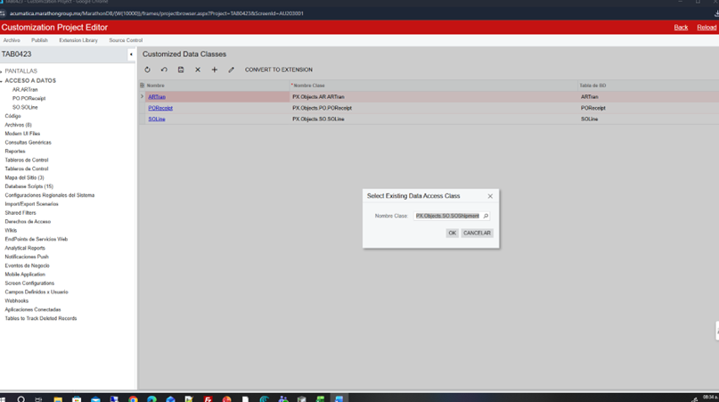

- Agrega un nuevo campo de tipo DateTime con los siguientes datos:
  - Nombre de Campo: UsrPreparationDate (Acumatica añadirá automáticamente el prefijo "Usr").
  - Mostrar Nombre: Fecha Preparación
  - Tipo de Almacenamiento: Mantenlo en DBTableColumn (esto es vital para que se cree físicamente en la tabla SOShipment de SQL).  
  - Tipo de Dato: Selecciona DateTime.

  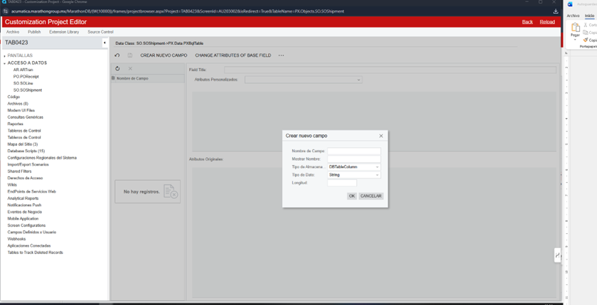


- Una vez creado el campo, cambia los atributos por los siguientes:

```csharp
[PXDBDateAndTime(UseTimeZone = true)]
[PXUIField(DisplayName = "Fecha Preparación", Enabled = false)]
```

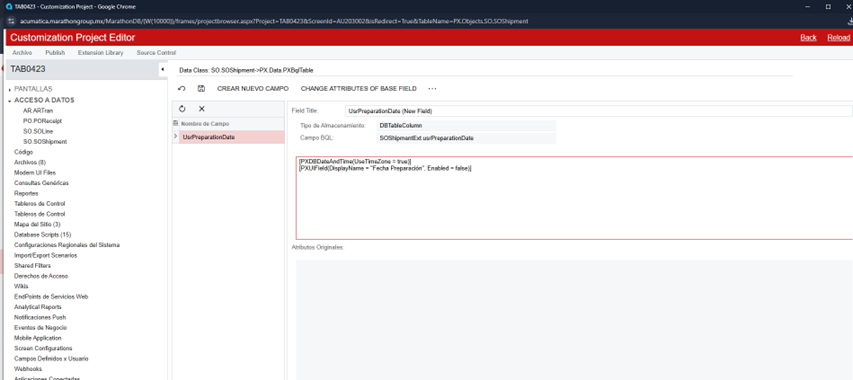

Guarda los cambios.

## 2. Implementación de la Lógica de Negocio (C# Code)

Aquí vincularemos la acción del botón con la actualización de la fecha.
- En el panel izquierdo, vaya a la sección CÓDIGO y haga clic en Archivos.
- Haga clic en el botón "+" (Nuevo Archivo).
- En la ventana, seleccione:
  - Tipo de Objeto: Graph Extension.
  - Base Screen: SO302000 (SOShipmentEntry).

  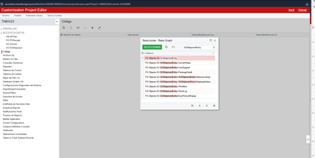

- Doble clic

  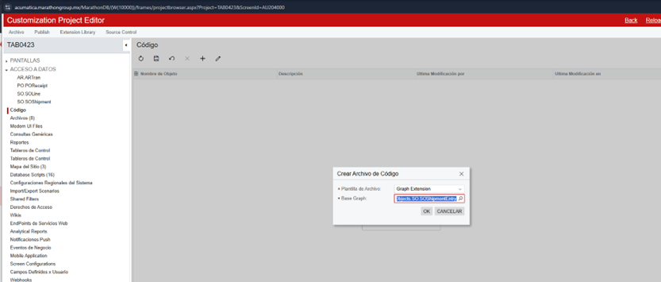

- Haga clic en OK. Se abrirá el editor de código.
- Reemplace todo el contenido del archivo con el siguiente bloque de código:

```csharp
using System;
using PX.Common;
using PX.Data;
using PX.Objects.SO;

namespace PX.Objects.SO
{
  public class SOShipmentEntry_Extension : PXGraphExtension<SOShipmentEntry>
  {
    public PXAction<SOShipment> materialPreparado;
    
    [PXButton(CommitChanges = true)]
    [PXUIField(DisplayName = "Material Preparado", MapEnableRights = PXCacheRights.Update)]
    protected virtual void MaterialPreparado()
    {
        SOShipment shipment = Base.Document.Current;
        if (shipment == null) return;

        // Obtener la extensión del registro
        SOShipmentExt shipExt = shipment.GetExtension<SOShipmentExt>();
        
        // Asignar fecha y hora actual usando la librería PX.Common
        shipExt.UsrPreparationDate = PXTimeZoneInfo.Now;

        // Actualizar el cache y guardar
        Base.Document.Update(shipment);
        Base.Save.Press();
    }

    // --- NUEVO CÓDIGO: Evento RowSelected para habilitar el botón en Confirmado ---
    protected virtual void _(Events.RowSelected<SOShipment> e)
    {
        if (e.Row == null) return;

        // Validamos si el embarque ya se encuentra en estado Confirmado
        if (e.Row.Status == SOShipmentStatus.Confirmed)
        {
            // 1. Encendemos el botón explícitamente
            materialPreparado.SetEnabled(true);

            // 2. Desbloqueamos la caché para que te permita guardar la fecha
            // sin arrojar error de "registro de solo lectura"
            e.Cache.AllowUpdate = true;
        }
    }
  }
}
```

- Haga clic en el botón Save del editor de código.

## 3. Registro de la Acción en la Pantalla

- Regrese al panel izquierdo, bajo SO302000, haga clic en el nodo Acciones (Actions).
- Haga clic en el signo "+".
- Llene la ventana de Propiedades de la Acción:
  - Nombre de la Acción: materialPreparado (Igual que en el código).
  - Mostrar Nombre: Material preparado.
  - Tipo de Acción: Tipo de acción -> Flujo de trabajo.
  - Categoría: Acciones (o "Procesando").
- Haga clic en OK y luego en el Disco (Guardar).

## 4. Configuración del Flujo de Trabajo (Workflow)

Este paso es crítico para la versión 2025 R2.
- Bajo SO302000, haga clic en Flujos de trabajo (Workflows).
- Haga clic en ADD WORKFLOW en la parte superior.
- Configure la extensión:
  - Operación: Extend System Workflow.
  - Base Workflow: Default workflow.
  - Workflow type: DEFAULT
  - Nombre de Flujo: ExtEmbarques.
- Haga clic en OK.

  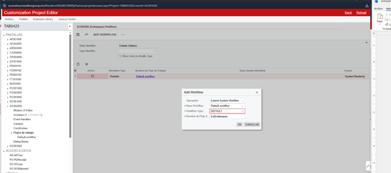

- En la lista de flujos, marque la casilla Activo para su nuevo flujo ExtEmbarques y haga clic en Guardar.
- Haga clic en el nombre azul ExtEmbarques para entrar al editor.

  

- Registro Global: 
  - En el árbol izquierdo, seleccione el nodo raíz — (Inherited).
  - En la pestaña ACCIONES del centro, haga clic en "+".
  - Seleccione Material preparado y haga clic en OK.

  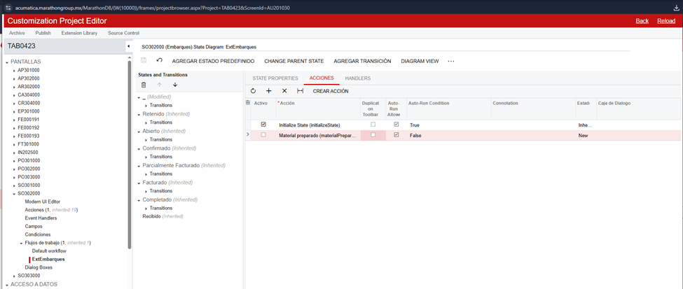

- Asignación a Estado Confirmado:
  - En el árbol izquierdo, seleccione Confirmado (Inherited).
  - En la pestaña ACCIONES del centro, haga clic en "+".
  - Seleccione Material preparado y haga clic en OK.
  - IMPORTANTE: En la cuadrícula de acciones de este estado, busque la columna Duplicate on Toolbar y marque la casilla para Material preparado.

  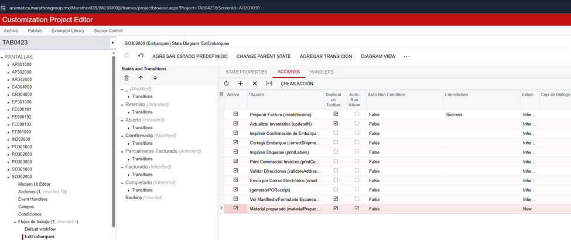

- Haga clic en el Disco (Guardar).
- En el menú superior del proyecto, haga clic en Publish y luego en Publish Current Project.

## 5. Colocar los campos necesarios en la interfaz

- Ir a PANTALLAS SO302000 

  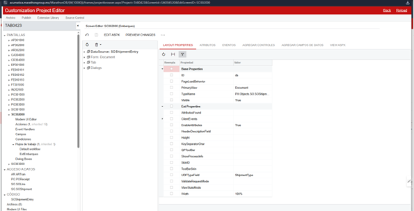

- Ir a From: Document (Expandir) Row (Expandir)

  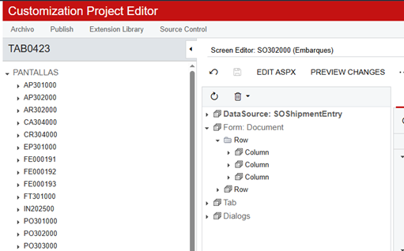

- Dar Clic en Row luego en AGREGAR CONTROLES después en LAYOUT RULES y jalar el botón columna hasta la posición en dónde deseas agregar la columna del lado derecho

  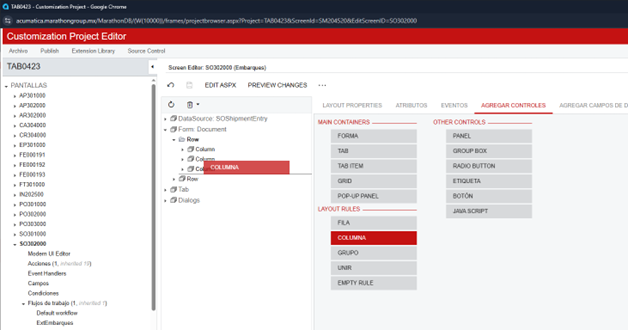


## 6. Finalización

1. En el menú superior del proyecto, haga clic en Publish y luego en Publish Current Project.
2. Una vez publicado, abra la pantalla de Embarques y valide en un registro Confirmado que el botón aparezca en la barra principal y asigne la fecha correctamente al presionarlo.
