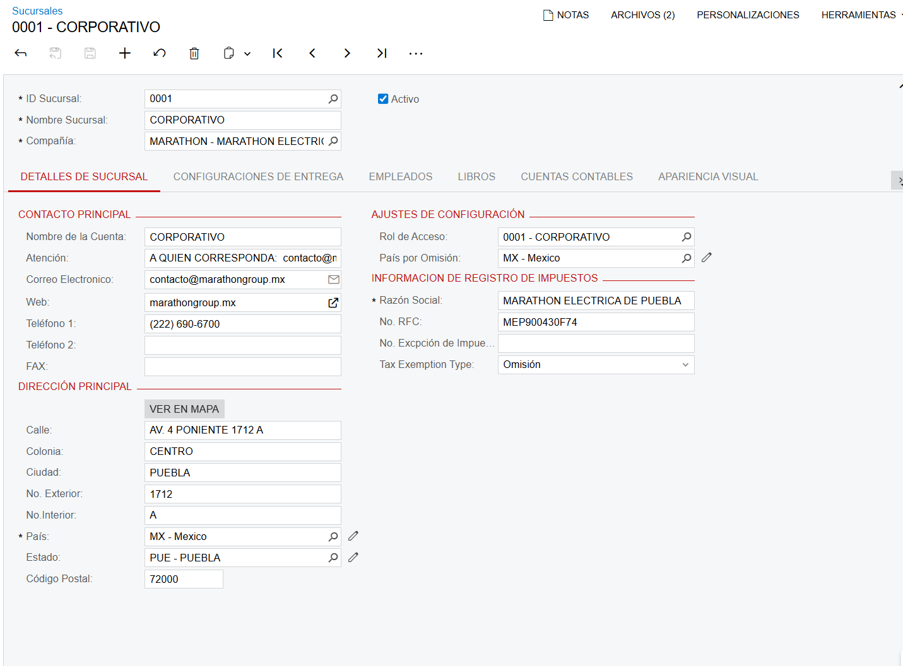

# Creación de sucursal **0001** (Gastos Corporativos) en Acumatica 2024 R2

> Documento operativo para replicar en productivo.  
> Generado: **2026-02-12 15:28**

:::note Alcance
Este documento consolida lo realizado/validado en el proyecto y lo convierte en un procedimiento repetible para productivo.  
En el proyecto se confirmó que una **Factura de proveedor** (*AP Bill*) se pudo **guardar** y **liberar** sin error, generando su **lote contable** (*Batch*).
:::

## 1. Prerrequisitos

- Acceso con rol de **Administrador del sistema** (*System Administrator*) o permisos equivalentes.
- **Catálogo de cuentas** (*Chart of Accounts*) y **Libros contables** (*Ledgers*) configurados en la compañía.
- **Períodos financieros** (*Financial Periods*) abiertos para el mes en curso.
- Definir si la sucursal 0001 compartirá configuración fiscal (impuestos, zonas fiscales, CFDI) con otra sucursal o llevará configuración propia.
- Definir alcance: solo gastos (**Cuentas por pagar** / *AP*) o también **Caja/Bancos** (*CA*), **Compras** (*PO*), **Inventarios** (*IN*), etc.

## 2. Parámetros del alta (plantilla)

| Campo | Valor |
|---|---|
| ID de sucursal (*Branch ID*) | **0001** |
| Nombre (*Branch Name*) | **CORPORATIVO** (o **GASTOS CORPORATIVOS**, según convención interna) |
| Compañía | **MARATHON – MARATHON ELECTRIC** (según ambiente) |
| Moneda base (*Base Currency*) | MXN (si aplica) |
| Libro de contabilización (*Posting Ledger*) | Libro principal (por ejemplo, **ACTUAL** / el que uses para contabilidad legal) |

## 3. Procedimiento paso a paso (repetible en productivo)

### Paso 1 — Crear la sucursal
1. Ir a **Organización → Sucursales** (*Organization → Branches*).
2. Crear registro nuevo y capturar datos base:
   - ID de sucursal: **0001**
   - Nombre sucursal: **CORPORATIVO**
   - Activar la sucursal (**Activo**)
3. Guardar.

### Paso 2 — Configurar Rol de acceso de la sucursal (seguridad)
1. En la pantalla de Sucursales, ubicar el campo **Rol de Acceso** (*Access Role*).
2. Seleccionar/crear el rol correspondiente (por ejemplo: **0001 - CORPORATIVO**).

:::tip Pantallas clave (IDs)
- **SM201005 – Roles** (*User Roles*): creación/ajuste del rol.  
- **SM201010 – Usuarios** (*Users*): asignación del rol y permisos (incluyendo sucursal).
:::

### Paso 3 — Control de acceso por usuario (sucursal permitida)
1. Ir a **Administración del sistema → Usuarios** (*System Management → Users*).
2. Asignar el rol correspondiente y permitir el acceso a la sucursal **0001** según la política de seguridad.
3. Guardar.

### Paso 4 — Crear/ajustar secuencias de numeración (consecutivos)
1. Ir a **Administración del sistema → Secuencias de numeración** (*System Management → Numbering Sequences*).
2. Crear o clonar secuencias para la sucursal **0001**, cuidando que no existan colisiones con otras sucursales.

:::warning Recomendación
Si tu operación requiere folios **por sucursal**, define prefijos/series propias (como las listadas en la sección **Especificación de sucursal**).
:::

### Paso 5 — Asignar secuencias en preferencias por módulo
> Esto significa “amarrar” qué secuencia usa cada tipo de documento.

- **Cuentas por pagar – Preferencias** (*Accounts Payable Preferences*): facturas, pagos, ajustes, etc.
- **Contabilidad general – Preferencias** (*General Ledger Preferences*): lotes (*Batch*).
- **Caja/Bancos – Preferencias** (*Cash Management Preferences*), si aplica: transacciones y transferencias bancarias.

:::note Si ya existe para otras sucursales…
- Si la numeración es **compartida** (global), normalmente **no** se repite.  
- Si la numeración es **por sucursal** (series distintas), entonces **sí** debes asegurar que la sucursal 0001 use sus secuencias.
:::

### Paso 6 — Validar configuración contable
1. Confirmar **Libro contable** (*Ledger*) y reglas de subcuentas/segmentos si se usan.
2. Verificar cuentas de gasto/impuestos/proveedores.

### Paso 7 — Prueba mínima funcional (Cuentas por pagar)
1. Cambiar a la sucursal **0001**.
2. Crear una **Factura de proveedor** (*AP Bill*):
   - Capturar proveedor, fecha, cuenta de gasto, importe e impuestos (si aplica)
3. Guardar y **Liberar** (*Release*).
4. Resultado esperado: documento liberado sin error y creación de un **lote contable** (*Batch*).

### Paso 8 — Verificar lote contable generado
1. Abrir el lote desde el vínculo del documento o ir a **Contabilidad general → Lotes** (*General Ledger → Batches*).
2. Validar:
   - período financiero
   - cuentas y subcuentas/segmentos
   - balanceo (Debe = Haber)
   - referencia al documento fuente

### Paso 9 — Cierre
- Guardar evidencia (capturas, exportaciones) y registrar prefijos/IDs creados.
- Entregar checklist a Contabilidad para validación final.

## 4. Checklist mínimo para Contabilidad

- La sucursal **0001** aparece en el selector y puede ser utilizada por los perfiles autorizados.
- Las secuencias generan folios en el formato esperado (sin duplicados).
- Una Factura de proveedor liberada genera lote contable y afecta cuentas correctas (gasto, impuestos, proveedor).
- Períodos financieros correctos y sin bloqueos por cierre.
- Lote contable balanceado (Debe = Haber) y con referencias correctas.
- Reportes por sucursal (mayor, balanza, auxiliares) reflejan movimiento de la sucursal 0001.

## 5. Especificación de sucursal

### 5.1 Datos de la sucursal (capturados en pantalla)

| Campo | Valor |
|---|---|
| ID Sucursal | 0001 |
| Nombre Sucursal | CORPORATIVO |
| Compañía | MARATHON - MARATHON ELECTRIC |
| Activo | Sí |
| Rol de Acceso | 0001 - CORPORATIVO |
| País por Omisión | MX - Mexico |
| Razón Social | MARATHON ELECTRICA DE PUEBLA |
| RFC | MEP900430F74 |
| Tipo de exención de impuestos (*Tax Exemption Type*) | Omisión |
| Contacto – Nombre de la cuenta | CORPORATIVO |
| Contacto – Atención | A QUIEN CORRESPONDA |
| Contacto – Correo electrónico | contacto@marathongroup.mx |
| Contacto – Web | marathongroup.mx |
| Contacto – Teléfono 1 | (222) 690-6700 |
| Dirección – Calle | AV. 4 PONIENTE 1712 A |
| Dirección – Colonia | CENTRO |
| Dirección – Ciudad | PUEBLA |
| Dirección – No. Exterior | 1712 |
| Dirección – No. Interior | A |
| Dirección – País | MX - Mexico |
| Dirección – Estado | PUE - PUEBLA |
| Dirección – Código Postal | 72000 |

### 5.2 Tabla de consecutivos (secuencias de numeración)

| Nombre | Consecutivo | Descripción | Comentarios |
|---|---|---|---|
| BATCH | OGL00000 | Pólizas Contabilidad |  |
| CATRAN | OTR00000 | TRANSACCIONES DE TESORERIA |  |
| CATRANSFER | OTN00000 | TRANSFERENCIAS BANCARIAS |  |
| CAPOLIZA | OCA00000 | POLIZA ADMON EFECTIVO |  |
| APPOLIZA | OOP00000 | Póliza CXP |  |
| APBILL | OF00000 | Facturas CXP |  |
| APPAYMENT | PO00000 | Pagos CXP | Para este caso el identificador de la sucursal y del documento estan intercambiados |
| APDEBIT | OD00000 | Ajuste de Cargo CXP |  |
| APCREDIT | POC00000 | Ajuste de Credito CXP | En este caso el identificador del documento aparece en la primera y tercera letra |
| ARPOLIZA | OPR00000 | POLIZAS DE CXC |  |
| ARINVOICE | ORF00000 | Factura AR |  |
| ARPAYMENT | OP000000 | PAGOS AR | Es P+ cero |
| ARDEBIT | ORD00000 | NOTA DE CARGO AR |  |
| ARCREDIT | ONCAR00000 | NOTA DE CREDITO AR |  |
| ARELIMSDOS | ESPO00000 | AR ELIMININACION SALDOS PEQUEÑOS |  |
| INPOLIZA | OIN00000 | POLIZA DE INVENTARIO |  |
| INRECEIPT | OEI00000 | ENTRADAS ALMACEN |  |
| INISSUE | OSI00000 | SALIDA INVENTARIOS |  |
| INADJUST | OAI00000 | AJUSTES INVENTARIOS |  |
| INKITASSY | OKI00000 | ENSAMBLE DE KITS |  |
| PIID | OIF00000 | IDENTIFICACION DE INVENTARIO |  |
| INREPL | ORI00000 | REABASTECIMIENTO INVENTARIO |  |
| PORECEIPT | ORC00000 | RECEPCIONES DE COMPRA |  |
| POORDER | OOC00000 | ORDENES DE COMPRA |  |
| POLANDCOST | OCI00000 | TRANSACCIONES COSTOS DE IMPORTACION |  |
| SOSHIPMENT | O000000 | EMBARQUE VENTAS |  |
| RQREQUISIT | ORE00000 | REQUISICION |  |
| RQITEM | OSA00000 | SOLICITUD DE ARTICULOS |  |
| OPPORTUNTY | OO00000 | Oportunidades | Para este caso el identificador de la sucursal y del documento estan intercambiados |
| CASE | OC00000 | Casos |  |
| CRQUOTE | OQ00000 | Quotes in CRM |  |
| EPCLAIM | OCG00000 | SOLICITUD GASTOS EP | Esta mal la descripción en las sucursales en realidad significa comprobación de gastos |
| EPRECEIPT | OCE00000 | Recepciones de gastos EP |  |
| DR | DO000000 | DEVOLUCION REGULAR | Para este caso el identificador de la sucursal y del documento estan intercambiados |
| CR | NCO000000 | NOTA DE CREDITO REGULAR/FINANCIERA CXC | Para este caso el identificador de la sucursal y del documento estan intercambiados |
| HF | HO000000 | NOTA DE CARGO FINANCIERA | Para este caso el identificador de la sucursal y del documento estan intercambiados |
| CO | NO000000 | NOTA DE CARGO FINANCIERA CXC | Para este caso el identificador de la sucursal y del documento estan intercambiados |
| LF | LO000000 | FACTURA FINANCIERA | Para este caso el identificador de la sucursal y del documento estan intercambiados |
| FF | OFR000000 | FACTURA REGULAR/FINANCIERA CXC |  |
| NA | NAO000000 | NOTA DE CREDITO ANTICIPO | Para este caso el identificador de la sucursal y del documento estan intercambiados |
| CA | ACO000000 | NOTA DE CREDITO ANTICIPO CXC | Para este caso el identificador de la sucursal y del documento estan intercambiados |
| NF | NCFO000000 | NOTA DE CREDITO FINANCIERA | Para este caso el identificador de la sucursal y del documento estan intercambiados |
| PA | AO000000 | FACTURA ANTICIPO | Para este caso el identificador de la sucursal y del documento estan intercambiados |
| FA | FAO999999 | FACTURA ANTICIPO CXC | Para este caso el identificador de la sucursal y del documento estan intercambiados |
| QT | QO000000 | COTIZACION | Para este caso el identificador de la sucursal y del documento estan intercambiados |
| TR | TO000000 | TRANSFERENCIA | Para este caso el identificador de la sucursal y del documento estan intercambiados |
| VR | VO000000 | VENTA REGULAR | Para este caso el identificador de la sucursal y del documento estan intercambiados |
