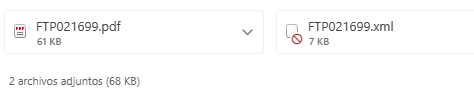
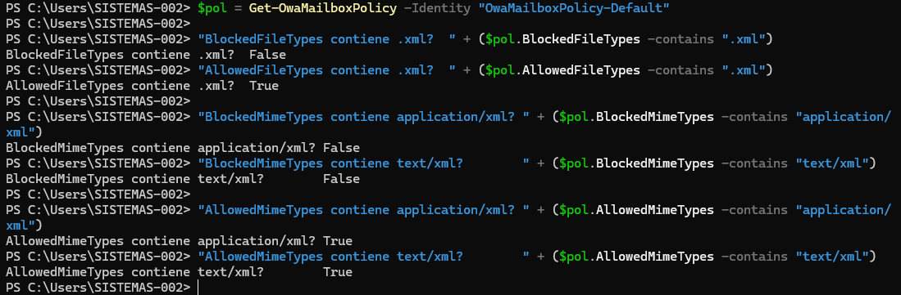
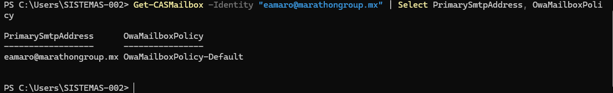
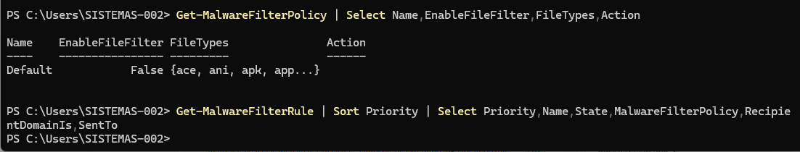
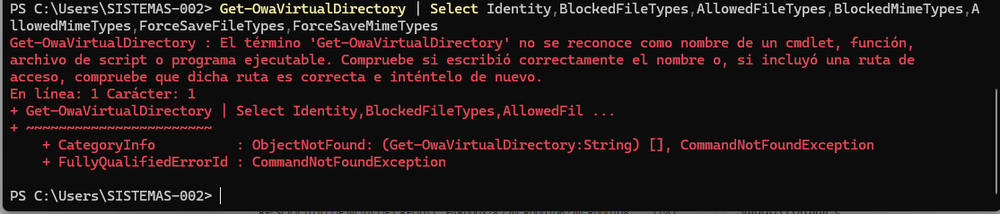
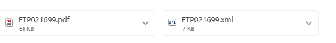

# Reporte técnico

**Elaboró:** Erika Amaro Camargo  
**Fecha:** 17 de febrero de 2026  
**Correo:** eamaro@marathongroup.mx  

---

## 1. Objetivo

Restaurar la capacidad de **visualizar y descargar archivos `.xml` adjuntos** en el **Nuevo Outlook para Windows**, validando el comportamiento en **Outlook en la Web (OWA)** y asegurando que la política aplique a los buzones de la organización.

---

## 2. Alcance y entorno

- Plataforma: **Microsoft 365 / Exchange Online**
- Cliente afectado: **Nuevo Outlook para Windows** (basado en OWA)
- Síntoma: el archivo `.xml` aparece como **restringido/bloqueado** (mientras que otros adjuntos como `.pdf` sí se descargan).



---

## 3. Hallazgos (causa raíz)

1. La **política OWA** aplicada (`OwaMailboxPolicy-Default`) tenía:
   - `.xml` dentro de **BlockedFileTypes**
   - `application/xml` y `text/xml` dentro de **BlockedMimeTypes**
2. Aunque se corrigió la política, algunos usuarios seguían viendo el bloqueo en Nuevo Outlook por **caché de sesión/cliente** hasta cerrar y volver a iniciar sesión.
3. Se descartó bloqueo por **Anti-malware file filter**, ya que `EnableFileFilter` estaba en `False`.

---

## 4. Evidencia técnica (comandos y resultados)

### 4.1 Identificación de políticas OWA disponibles

```powershell
Get-OwaMailboxPolicy | Select Name
```

Resultado esperado: existencia de `OwaMailboxPolicy-Default`.

---

### 4.2 Validación de bloqueo explícito para `.xml`

> En PowerShell, las listas suelen verse truncadas. Se validó de forma explícita con `-contains`.

```powershell
$pol = Get-OwaMailboxPolicy -Identity "OwaMailboxPolicy-Default"

"BlockedFileTypes contiene .xml?  " + ($pol.BlockedFileTypes -contains ".xml")
"AllowedFileTypes contiene .xml?  " + ($pol.AllowedFileTypes -contains ".xml")

"BlockedMimeTypes contiene application/xml? " + ($pol.BlockedMimeTypes -contains "application/xml")
"BlockedMimeTypes contiene text/xml?        " + ($pol.BlockedMimeTypes -contains "text/xml")
```

---

### 4.3 Ajuste de política (desbloquear XML)

> Se desbloqueó **solo** `.xml` y sus MIME types; no se cambiaron extensiones relacionadas como `.ps1xml`, `.mshxml`, etc.

```powershell
Set-OwaMailboxPolicy -Identity "OwaMailboxPolicy-Default" -BlockedFileTypes @{Remove = ".xml"}
Set-OwaMailboxPolicy -Identity "OwaMailboxPolicy-Default" -AllowedFileTypes @{Add = ".xml"}

Set-OwaMailboxPolicy -Identity "OwaMailboxPolicy-Default" -BlockedMimeTypes @{Remove = "application/xml","text/xml"}
Set-OwaMailboxPolicy -Identity "OwaMailboxPolicy-Default" -AllowedMimeTypes @{Add = "application/xml","text/xml"}
```

---

### 4.4 Validación posterior al cambio (resultado final)

```powershell
$pol = Get-OwaMailboxPolicy -Identity "OwaMailboxPolicy-Default"

"BlockedFileTypes contiene .xml?  " + ($pol.BlockedFileTypes -contains ".xml")
"AllowedFileTypes contiene .xml?  " + ($pol.AllowedFileTypes -contains ".xml")

"BlockedMimeTypes contiene application/xml? " + ($pol.BlockedMimeTypes -contains "application/xml")
"BlockedMimeTypes contiene text/xml?        " + ($pol.BlockedMimeTypes -contains "text/xml")

"AllowedMimeTypes contiene application/xml? " + ($pol.AllowedMimeTypes -contains "application/xml")
"AllowedMimeTypes contiene text/xml?        " + ($pol.AllowedMimeTypes -contains "text/xml")
```

Resultado esperado:
- Blocked… = `False`
- Allowed… = `True`



---

### 4.5 Confirmación de política efectiva en buzón afectado

```powershell
Get-CASMailbox -Identity "eamaro@marathongroup.mx" | Select PrimarySmtpAddress, OwaMailboxPolicy
```



> Si un usuario tiene otra policy, el cambio debe replicarse en esa policy o reasignarse el buzón a la policy estándar.

---

### 4.6 Descartar Anti-malware file filter (Defender)

```powershell
Get-MalwareFilterPolicy | Select Name,EnableFileFilter,FileTypes,Action
Get-MalwareFilterRule | Sort Priority | Select Priority,Name,State,MalwareFilterPolicy,RecipientDomainIs,SentTo
```

Resultado observado: `EnableFileFilter = False` y sin reglas adicionales aplicadas.



---

### 4.7 Nota: cmdlet no disponible en Exchange Online

Se intentó usar un cmdlet propio de entornos **On-Prem**, lo cual confirmó que el entorno es Exchange Online:



---

## 5. Pruebas funcionales (aceptación)

### 5.1 Validación en OWA (modo privado / incógnito)

- Se abrió el mismo correo en OWA **en sesión privada**.
- Se confirmó que el `.xml` **ya permite descargar**.



### 5.2 Validación en Nuevo Outlook

- En equipos donde seguía apareciendo restringido:
  1. Cerrar Nuevo Outlook
  2. Volver a iniciar sesión (re-autenticación)
- Después del reinicio de sesión, el `.xml` se visualiza/descarga correctamente.

---

## 6. Checklist de verificación para otros usuarios

1. Confirmar que el buzón usa `OwaMailboxPolicy-Default`:
   ```powershell
   Get-CASMailbox -Identity "usuario@marathongroup.mx" | Select PrimarySmtpAddress,OwaMailboxPolicy
   ```
2. Probar descarga en **OWA en incógnito**.
3. Si OWA funciona y Nuevo Outlook no:
   - Cerrar Nuevo Outlook y **volver a iniciar sesión**.

---

## 7. Consideraciones de seguridad

> Permitir `.xml` puede incrementar superficie de riesgo si llegan archivos maliciosos disfrazados.  

Recomendaciones:
- Mantener controles de **Defender** (Safe Attachments/Anti-phishing) activos.
- Limitar cambios únicamente a `.xml` (no habilitar extensiones administrativas como `.ps1xml`).
- Documentar el cambio y revisar periódicamente.

---

## 8. Rollback (revertir el cambio)

Si se requiere volver a bloquear `.xml`:

```powershell
Set-OwaMailboxPolicy -Identity "OwaMailboxPolicy-Default" -AllowedFileTypes @{Remove = ".xml"}
Set-OwaMailboxPolicy -Identity "OwaMailboxPolicy-Default" -BlockedFileTypes @{Add = ".xml"}

Set-OwaMailboxPolicy -Identity "OwaMailboxPolicy-Default" -AllowedMimeTypes @{Remove = "application/xml","text/xml"}
Set-OwaMailboxPolicy -Identity "OwaMailboxPolicy-Default" -BlockedMimeTypes @{Add = "application/xml","text/xml"}
```

---

## 9. Registro de cambios

- Se actualizó `OwaMailboxPolicy-Default` para permitir:
  - FileTypes: `.xml`
  - MimeTypes: `application/xml`, `text/xml`
- Se validó en OWA (incógnito) y se resolvió en Nuevo Outlook tras reinicio de sesión.

---

## 10. Referencias

- Microsoft Learn: resolución de adjuntos bloqueados en Outlook en la Web (OWA) mediante OwaMailboxPolicy.
