# Crear directiva de retención de correo para 12 meses

**Creado por:** Erika Amaro Camargo  
**Fecha:** 24 de abril de 2026

## Objetivo

Configurar una directiva de retención de correo para un periodo de **12 meses**. Cuando un correo alcanza una antigüedad de 12 meses, se mueve automáticamente al archivo, siempre que el buzón de archivo esté habilitado y tenga espacio disponible.

## Acceso a Microsoft Purview

1. Entrar a **Microsoft Purview**.

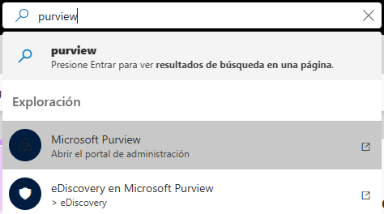

2. Hacer clic en **Soluciones** y después en **Administración del ciclo de vida de datos**.

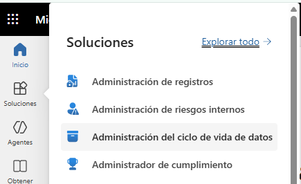

3. Las directivas de retención que aplican al correo están en **Exchange (heredados)**.

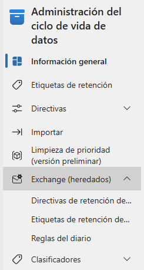

4. Al entrar en **Directivas de retención**, se muestran las políticas disponibles.

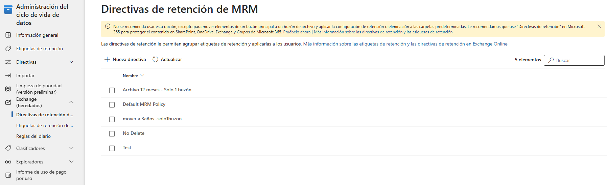

## Revisión de la directiva predeterminada

La directiva aplicada por defecto en la mayoría de los buzones es **Default MRM Policy**. Al seleccionarla, se habilita la opción **Editar**.

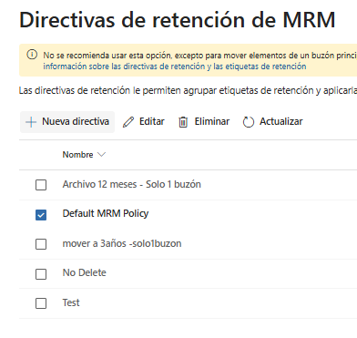

Hacer clic en **Editar** para revisar su configuración.

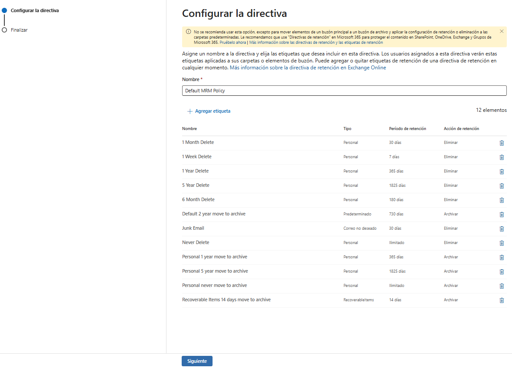

Esta directiva agrupa **12 etiquetas de retención** que se aplican a buzones o carpetas de correo para definir cuánto tiempo se conservan los mensajes y qué acción se ejecuta después del periodo configurado.

Incluye etiquetas para:

- Eliminar correos después de 7 días, 30 días, 180 días, 1 año o 5 años.
- Archivar correos después de 1 año, 2 años o 5 años.
- Conservar correos de forma ilimitada, como **Never Delete** o **never move to archive**.
- Aplicar reglas específicas a **Junk Email** y **Recoverable Items**.

En resumen, esta política controla automáticamente el ciclo de vida del correo: algunos mensajes se eliminan tras cierto tiempo y otros se mueven al archivo, según la etiqueta de retención aplicada.

## Creación de la nueva etiqueta

En **Etiquetas de retención**, las etiquetas en inglés son las predefinidas. Las etiquetas en español son las creadas manualmente. Para este caso, se creó la etiqueta **Mover a Archivo - 12 meses**, de tipo **Predeterminado**.

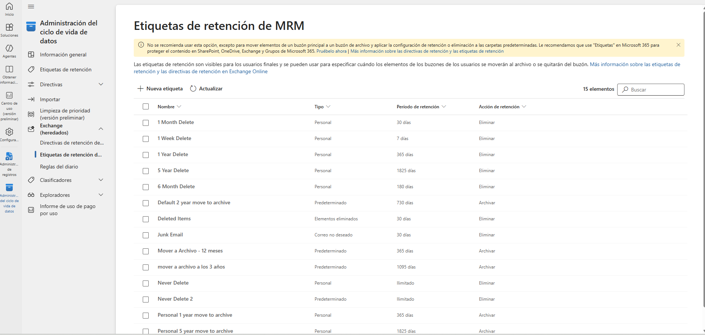

### Tipos de etiquetas de retención

| Tipo | Qué significa | Ejemplo |
| --- | --- | --- |
| **Personal** | Etiquetas que el usuario puede aplicar manualmente a correos o carpetas. Sirven para elegir una regla específica distinta a la predeterminada. | **1 Month Delete**, **1 Year Delete**, **Never Delete**, **Personal 5 year move to archive** |
| **Predeterminado** | Etiqueta que se aplica automáticamente a todo el buzón o a los elementos que no tengan otra etiqueta más específica. Es la regla general de la política. | **Default 2 year move to archive** |
| **Correo no deseado** | Etiqueta específica para la carpeta de correo no deseado. Aplica automáticamente a los mensajes ubicados en **Junk Email**. | **Junk Email** |
| **RecoverableItems** | Etiqueta aplicada a la carpeta oculta de elementos recuperables, donde quedan mensajes eliminados antes de su eliminación definitiva o recuperación. | **Recoverable Items 14 days move to archive** |

La diferencia principal es **dónde y cómo se aplica la etiqueta**. Las etiquetas **Personal** dependen de la selección manual del usuario; la etiqueta **Predeterminada** actúa como regla general automática; y las etiquetas de carpetas especiales, como **Correo no deseado** o **RecoverableItems**, se aplican automáticamente solo a esas ubicaciones específicas.

## Configuración de la directiva

1. Hacer clic en **Nueva directiva**.
2. Asignar el nombre **Archivo 12 meses - Solo 1 buzón**.
3. Hacer clic en **Editar** para agregar las etiquetas que formarán parte de la directiva.
4. Agregar la etiqueta predeterminada **Mover a Archivo - 12 meses** y las etiquetas complementarias necesarias.

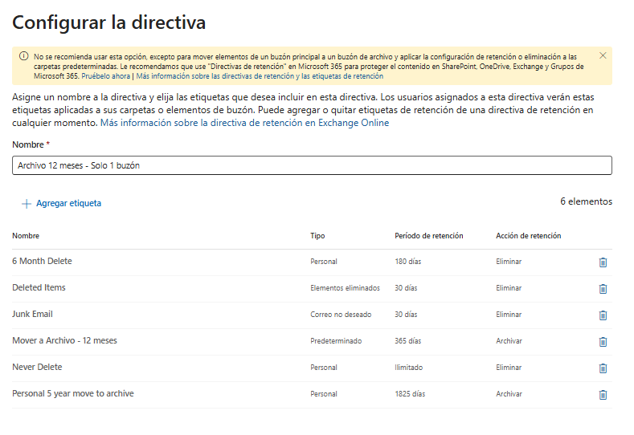

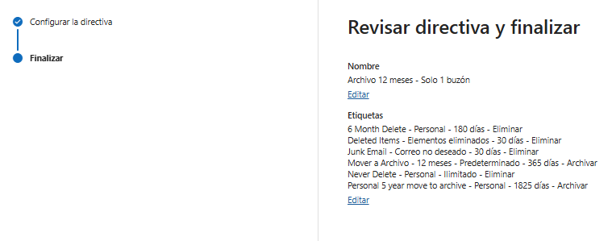

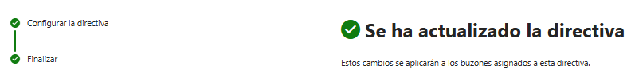

## Asignación de la directiva al buzón

Para asignar la directiva al buzón, entrar a **Exchange** y seleccionar el buzón correspondiente.

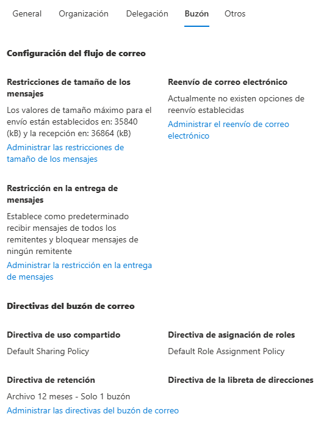

Seleccionar la directiva creada y guardar los cambios.

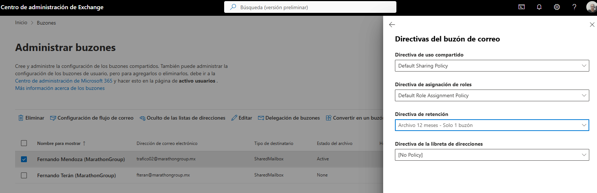

## Verificación y activación del archivado automático

**Buzón revisado:** `trafico02@marathongroup.mx`

### Paso a paso realizado

1. Conexión a PowerShell con el módulo de Exchange Online.

   ```powershell
   Connect-ExchangeOnline -UserPrincipalName eamaro@marathongroup.mx
   ```

2. Validación del buzón `trafico02@marathongroup.mx`.

3. Confirmación de la política asignada.

   ```powershell
   Get-Mailbox trafico02@marathongroup.mx | Select DisplayName,PrimarySmtpAddress,RetentionPolicy,ArchiveStatus
   ```

4. Confirmación de `ArchiveStatus: Active`.

5. Ejecución manual del proceso de archivado con `Start-ManagedFolderAssistant`.

   ```powershell
   Start-ManagedFolderAssistant -Identity trafico02@marathongroup.mx
   ```

6. Revisión del tamaño del buzón principal.

   ```powershell
   Get-MailboxStatistics trafico02@marathongroup.mx | Select DisplayName,TotalItemSize,ItemCount
   ```

7. Revisión inicial del buzón de archivo.

   ```powershell
   Get-MailboxStatistics trafico02@marathongroup.mx -Archive | Select TotalItemSize
   ```

8. Revisión posterior del buzón de archivo.

   ```powershell
   Get-MailboxStatistics trafico02@marathongroup.mx -Archive | Select TotalItemSize,ItemCount
   ```

9. Confirmación de que el archivado automático inició correctamente.

### Comandos utilizados

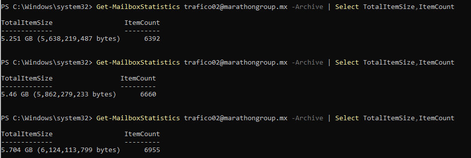

## Revisión posterior recomendada

Al día siguiente, revisar lo siguiente:

- El tamaño del buzón principal debería disminuir.
- El tamaño del buzón de archivo debería aumentar.
- Outlook / OWA debería mostrar el archivo en línea.
- Si el crecimiento del archivo se detiene, volver a ejecutar `Start-ManagedFolderAssistant`.

### Comandos de seguimiento

```powershell
Get-MailboxStatistics trafico02@marathongroup.mx | Select TotalItemSize
Get-MailboxStatistics trafico02@marathongroup.mx -Archive | Select TotalItemSize
Start-ManagedFolderAssistant -Identity trafico02@marathongroup.mx
```

## Conclusión final

La configuración es correcta. El buzón comenzó a mover correos antiguos al archivo. Se recomienda monitorear al día siguiente para confirmar la liberación de espacio.

La creación de una nueva directiva fue necesaria porque el usuario lleva aproximadamente 1 año de operación y sus correos no son tan antiguos. Sin embargo, al tener el buzón al **96 % de capacidad**, fue necesario habilitar esta directiva para liberar espacio mediante archivado automático.
